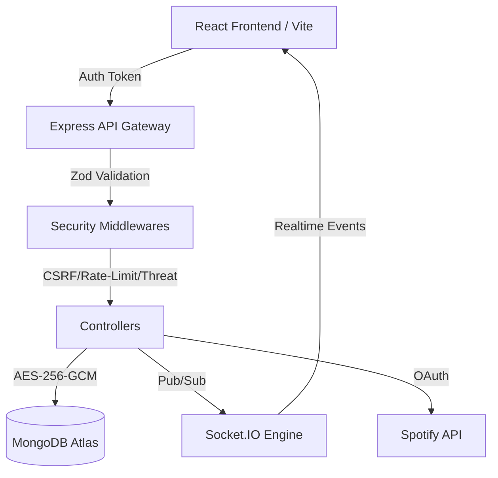

<div align="center">


# ✦ ORBIT
### *Immersive. Quantum-Secure. Hyper-Personalized.*

<br />

[](https://github.com/AagoshRajSri/Orbit)
[](https://github.com/AagoshRajSri/Orbit)
[](https://github.com/AagoshRajSri/Orbit)
[](https://orbitnexus.vercel.app)
[](https://orbit-ajgs.onrender.com)

<br />

**Orbit** is not just a chat application—it is a secure, immersive digital ecosystem designed for high-fidelity communication. Built on a foundation of zero-trust security and cutting-edge cryptography, Orbit combines a stunning glassmorphism UI with industrial-grade operational hardening.

[**Launch Orbit →**](https://orbitnexus.vercel.app) &nbsp;•&nbsp; [**API Documentation →**](https://orbit-ajgs.onrender.com) &nbsp;•&nbsp; [**Security Audit →**](#-security--cryptographic-hardening)

</div>

---

## 📸 Experience Orbit

Orbit reimagines digital identity and connection. From drawing your own **Constellation** to authenticate, to syncing **Spotify** playback in real-time across a **Nexus** (group), every interaction is fluid, animated, and secured.

### ✦ 3+ Dynamic Themes
Choose your aesthetic. Orbit features a library of fully-animated, immersive themes:
- **Amoled & Dark Cyberpunk**: Viewport-locked, high-contrast designs for the night.
- **Pastel Dream & Light**: Clean, airy, and glassmorphic layouts.
- **Gamer & Retro**: Neon-pulsing, high-energy interfaces with ambient crossfade music.

---

## 🛡️ Security & Cryptographic Hardening

Orbit is engineered for the highest level of operational security, moving beyond standard HTTPS into the realm of **Zero-Trust Infrastructure**.

### 🔐 Modern Cryptographic Stack
*   **X3DH Key Agreement**: Secure triple Diffie-Hellman handshake for initial trust.
*   **Double Ratchet Algorithm**: Perfect Forward Secrecy (PFS) for every message sent.
*   **AES-256-GCM Storage**: All sensitive tokens (Spotify, 3rd party) are encrypted at rest with authenticated encryption.
*   **ML-KEM-768 Hybrid**: Post-Quantum resistance experimental hooks for long-term data safety.

### 🏛️ Operational Security (OPSEC)
*   **Constellation Auth**: Biometric-gesture login using Argon2id hashing + server-side pepper. No passwords ever leave your mind.
*   **Device-Bound Sessions**: Sessions are cryptographically tied to unique hardware. Revoking a device instantly kills its specific session via granular invalidation.
*   **CSRF Protection**: Double-submit cookie pattern combined with strict CORS whitelisting.
*   **Rate Limiting 2.0**: Advanced per-user and per-IP limiters to stop botnets and brute-force attempts.
*   **Audit Logging**: Detailed tracking of all administrative actions and user data access.

---

## ✨ Core Features

| Feature | Capability |
| :--- | :--- |
| **Real-Time Sync** | Ultra-low latency messaging via Socket.IO with typing indicators and live presence. |
| **Nexus Groups** | Create private "Nexuses" with unique join codes and granular member controls. |
| **Spotify Shared Sessions** | Host a shared listening room. Playback skips, pauses, and seeks are synced in real-time. |
| **Media Engine** | Integrated GIPHY search and Cloudinary-backed image sharing with progress tracking. |
| **Identity Trust** | Device attestation signatures ensure only authorized hardware can access your account. |
| **Constellation Login** | A stateless, zero-knowledge authentication system that uses star patterns instead of passwords. |

---

## 🏗️ Technical Architecture



---

## 🚀 Getting Started

### 1. Requirements
- Node.js 18+
- MongoDB Instance
- Cloudinary & Spotify Developer Accounts

### 2. Local Setup
```bash
# Clone the universe
git clone https://github.com/AagoshRajSri/Orbit.git

# Ignite the Backend
cd backend && npm install
cp .env.example .env
npm run dev

# Launch the Frontend
cd ../frontend && npm install
cp .env.example .env
npm run dev
```

### 3. Environment Configuration
Ensure your `.env` contains the required security salts:
- `CONSTELLATION_PEPPER`: 64-character random string.
- `TOKEN_ENCRYPTION_SECRET`: Used for AES-256-GCM token storage.
- `OBFUSCATION_SECRET`: Separate from JWT_SECRET to ensure ID stability.

---

## ⚡ API Handshake

| Method | Endpoint | Use Case |
| :--- | :--- | :--- |
| `POST` | `/api/auth/constellation/login` | Secure pattern-based entry |
| `GET` | `/api/nexus/:id/messages` | Paginated group history |
| `POST` | `/api/spotify/session/sync` | Broadcast playback state |
| `DELETE` | `/api/devices/:id` | Revoke specific hardware access |

---

## 📄 License
Orbit is released under the **MIT License**.  
© 2025 Aagosh Raj Srivastava

<div align="center">
  <br />
  <sub>Built with intention · Secured by design · ✦ Orbit</sub>
</div>
