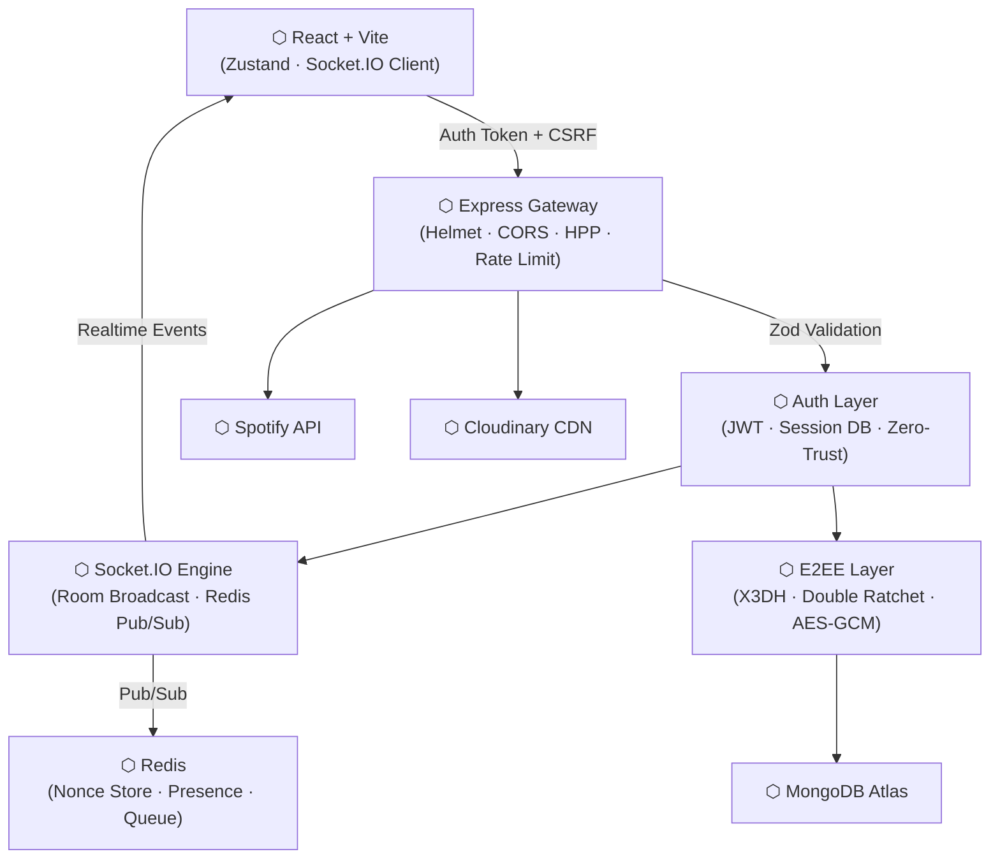

<div align="center">

<br />

```
   ✦  O  R  B  I  T  ✦
```

### *Where every message is a universe of its own.*

<br />

[](https://orbitnexus.vercel.app)
[](#-security--cryptography)
[](#-cryptographic-stack)
[](#-architecture)
[](https://orbitnexus.vercel.app)
[](https://orbit-ajgs.onrender.com)

<br />

> **Orbit is a high-security, real-time communication platform.**  
> It is built on Zero-Trust infrastructure, end-to-end encrypted with X3DH + Double Ratchet,  
> and designed to feel like the future of human connection.

<br />

[**→ Open Orbit**](https://orbitnexus.vercel.app) &nbsp;·&nbsp; [**→ API**](https://orbit-ajgs.onrender.com) &nbsp;·&nbsp; [**→ GitHub**](https://github.com/AagoshRajSri/Orbit)

</div>

---

<br />

## ✦ What is Orbit?

Most apps store your passwords. Orbit doesn't even ask for one.

Instead, you draw a **Constellation** — a personal star-pattern biometric — to authenticate. Your messages are encrypted before they leave your device using **X3DH key agreement** and **Double Ratchet** (the same protocol Signal uses). Your session is device-bound, your identity is self-sovereign, and your data is never the product.

Orbit is a fullstack MERN platform built for people who actually care about privacy — wrapped in a glass-morphic, theme-switching, Spotify-syncing, group-messaging interface that feels genuinely alive.

<br />

---

<br />

## 🌌 Features at a Glance

<br />

| ✦ | Feature | What it actually does |
|:--|:--|:--|
| 🔑 | **Constellation Auth** | Draw stars instead of typing passwords. Argon2id + pepper hashing. Zero-knowledge. |
| 🔐 | **End-to-End Encryption** | X3DH handshake + Double Ratchet. Every message has Perfect Forward Secrecy. |
| ⚡ | **Real-Time Everything** | Socket.IO-powered typing indicators, presence states, live read receipts. |
| 🌐 | **Nexus Groups** | Private group spaces with join codes, E2EE sender keys, and role controls. |
| 🎵 | **Spotify Shared Sessions** | Host a live listening room. Seeks, skips, and pauses sync to everyone instantly. |
| 🖼️ | **Media & GIFs** | Cloudinary image uploads with progress tracking. GIPHY integration built in. |
| 🎨 | **6 Immersive Themes** | Amoled, Dark Cyberpunk, Pastel, Light, Gamer, Retro — with ambient crossfade audio. |
| 🛡️ | **Device Attestation** | Sessions are cryptographically bound to hardware. Revoke any device, instantly. |
| 📡 | **Post-Quantum Hooks** | ML-KEM-768 hybrid KEM bundle for long-term data safety. |

<br />

---

<br />

## 🔐 Security & Cryptography

> Orbit treats security as a first-class design constraint — not an afterthought.

<br />

### Cryptographic Stack

```
┌─────────────────────────────────────────────────────────────┐
│                    ORBIT CRYPTO PIPELINE                    │
├─────────────────────────────────────────────────────────────┤
│  Key Agreement     →  X3DH (Triple Diffie-Hellman)          │
│  Messaging         →  Double Ratchet Algorithm              │
│  Encryption        →  AES-256-GCM (authenticated)           │
│  Auth Hashing      →  Argon2id + salt + server-side pepper  │
│  Post-Quantum      →  ML-KEM-768 hybrid bundle (exp.)       │
│  Signing           →  ECDSA per device                      │
└─────────────────────────────────────────────────────────────┘
```

<br />

### Zero-Trust Operational Security

Every layer of Orbit is designed so that **no single point of compromise breaks the whole system.**

- **Constellation Biometrics** — Pattern hashed with Argon2id + a server-side pepper that never touches the DB. No password ever stored.
- **Device-Bound Sessions** — JWT tokens bind to a specific `sessionId` in MongoDB. Revoking a session from any device kills it globally within milliseconds.
- **Replay Attack Defense** — Single-use challenge nonces (TTL: 2 min) for all biometric auth flows, stored atomically in Redis.
- **CSRF Double-Submit Cookie** — State-mutating endpoints require a cryptographically random token echoed from a `httpOnly=false` cookie.
- **ReDoS-Safe Search** — All user-supplied regex inputs are character-escaped before evaluation.
- **IP-Level Lockout** — Excessive constellation auth failures trigger progressive IP blocks (30s → 5m → 30m → 2h).
- **Threat Detection Middleware** — Behavioral anomaly checks on every request.
- **HPP Protection** — HTTP Parameter Pollution prevention via `hpp`.

<br />

---

<br />

## 🏗️ Architecture

<br />


```mermaid
graph TD
    Client["⬡ React + Vite\n(Zustand · Socket.IO Client)"]
    Gateway["⬡ Express Gateway\n(Helmet · CORS · HPP · Rate Limit)"]
    Auth["⬡ Auth Layer\n(JWT · Session DB · Zero-Trust)"]
    Socket["⬡ Socket.IO Engine\n(Room Broadcast · Redis Pub/Sub)"]
    Crypto["⬡ E2EE Layer\n(X3DH · Double Ratchet · AES-GCM)"]
    DB["⬡ MongoDB Atlas"]
    Redis["⬡ Redis\n(Nonce Store · Presence · Queue)"]
    Spotify["⬡ Spotify API"]
    CDN["⬡ Cloudinary CDN"]

    Client -->|Auth Token + CSRF| Gateway
    Gateway -->|Zod Validation| Auth
    Auth --> Socket
    Auth --> Crypto
    Crypto --> DB
    Socket -->|Pub/Sub| Redis
    Socket -->|Realtime Events| Client
    Gateway --> Spotify
    Gateway --> CDN
```

<br />

### Frontend

| Concern | Technology |
|:--|:--|
| Framework | React 18 + Vite |
| State | Zustand (atomic selectors) |
| Realtime | Socket.IO Client |
| Routing | React Router v6 |
| E2EE | Web Crypto API (IndexedDB key storage) |
| Media | Cloudinary + GIPHY |

### Backend

| Concern | Technology |
|:--|:--|
| Runtime | Node.js (ESM) |
| Framework | Express v5 |
| Database | MongoDB + Mongoose |
| Realtime | Socket.IO + Redis Adapter |
| Auth | JWT + Argon2id + Bcrypt |
| Validation | Zod |
| Queuing | Redis Pipeline (offline message delivery) |

<br />

---

<br />

## 🚀 Getting Started

### Prerequisites

- Node.js **18+**
- MongoDB (local or Atlas)
- Cloudinary account
- Spotify Developer app (optional — for music sync)
- Redis (optional — enables horizontal scaling & distributed nonce store)

<br />

### Clone & Run

```bash
# 1. Clone
git clone https://github.com/AagoshRajSri/Orbit.git
cd Orbit

# 2. Backend
cd backend
npm install
cp .env.example .env       # fill in your secrets
npm run dev                # nodemon on :5001

# 3. Frontend (new terminal)
cd ../frontend
npm install
npm run dev                # Vite on :5173
```

Open [http://localhost:5173](http://localhost:5173) ✦

<br />

### Critical Environment Variables

```bash
# backend/.env

MONGODB_URI=           # MongoDB connection string
JWT_SECRET=            # 64-char random string
CONSTELLATION_PEPPER=  # 64-char random string — NEVER expose this
TOKEN_ENCRYPTION_SECRET= # AES-256-GCM key for token storage
OBFUSCATION_SECRET=    # Separate from JWT secret — for ID obfuscation

CLOUDINARY_CLOUD_NAME=
CLOUDINARY_API_KEY=
CLOUDINARY_API_SECRET=

SPOTIFY_CLIENT_ID=
SPOTIFY_CLIENT_SECRET=

REDIS_URL=             # Optional — redis://localhost:6379
```

> ⚠️ `CONSTELLATION_PEPPER` must be set in production or the server will refuse to start.

<br />

---

<br />

## 📡 Key API Endpoints

| Method | Route | Description |
|:--|:--|:--|
| `GET` | `/api/auth/constellation/challenge` | Issue a single-use auth nonce |
| `POST` | `/api/auth/constellation/login` | Authenticate with star pattern |
| `POST` | `/api/auth/constellation/signup` | Register new constellation identity |
| `GET` | `/api/nexus/:id/messages` | Paginated group message history |
| `POST` | `/api/message/send/:receiverId` | Send an E2EE direct message |
| `POST` | `/api/spotify/session/sync` | Broadcast playback to a Nexus |
| `DELETE` | `/api/devices/:deviceId` | Revoke a specific hardware session |
| `GET` | `/health` | Service health (DB + Redis + Socket.IO) |

<br />

---

<br />

## ✦ Recent Engineering Highlights

- **Nexus Fan-out Optimization** — Replaced per-member socket iteration with native `io.to(nexusId).emit()` room broadcasting. Offline members are queued via Redis pipeline in a single atomic batch.
- **ReDoS Hardening** — User-supplied search strings in admin and contact search are regex-escaped before MongoDB query execution.
- **Read Receipt Accuracy** — `MessageStatusRing` components standardized to use `msg.seenAt` exclusively, eliminating false "read" visual states.
- **Presence Standardization** — Sidebar now correctly surfaces `Active recently` with `lastSeen` timestamps for offline users.
- **CSRF Coverage** — StarWeave biometric auth endpoints added to CSRF exempt list, unblocking all gesture-pattern login flows.
- **Route Deduplication** — Eliminated duplicate middleware registrations for `/api/admin` and `/api/contacts` in the Express entry point.

<br />

---

<br />

<div align="center">

## 📄 License

MIT License · © 2025 Aagosh Raj Srivastava

<br />

```
Built with intention · Secured by design
✦  O R B I T  ✦
```

*Every connection matters. Protect it accordingly.*

</div>
