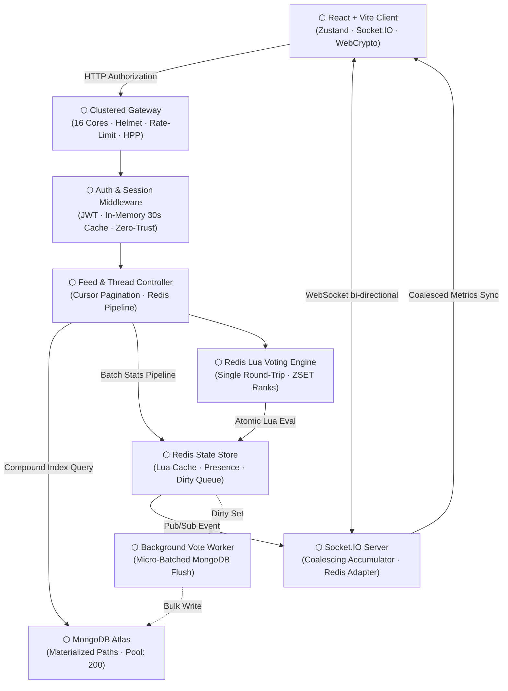

<div align="center">

<br />

```
   ✦  O  R  B  I  T  ✦
```

### *Where every message is a universe of its own.*

<br />

[](https://orbitnexus.vercel.app)
[](#-security--cryptography)
[](#-cryptographic-stack)
[](#-distributed-systems--performance-engineering)
[](#-empirical-load-testing--benchmarks)
[](#-empirical-load-testing--benchmarks)

<br />

> **Orbit is an enterprise-grade, high-concurrency real-time communication platform.**  
> Built on Zero-Trust infrastructure, end-to-end encrypted with X3DH + Double Ratchet,  
> and backed by an atomic Redis Lua voting engine, materialized-path discussion trees,  
> and a 16-core clustered architecture load-tested under sustained concurrency.

<br />

[**→ Launch Orbit**](https://orbitnexus.vercel.app) &nbsp;·&nbsp; [**→ Live API**](https://orbit-ajgs.onrender.com) &nbsp;·&nbsp; [**→ GitHub**](https://github.com/AagoshRajSri/Orbit)

</div>

---

<br />

## ✦ What is Orbit?

Most social platforms store your passwords in plain text or basic hashes and degrade under heavy write contention. Orbit does neither.

1. **Passwordless Biometric Identity:** You authenticate by drawing a **Constellation** — a personal star-pattern biometric hashed with Argon2id and a server-side pepper that never touches the database.
2. **Signal-Grade Cryptography:** Private direct communications are encrypted on-device before hitting the network using **X3DH (Extended Triple Diffie-Hellman)** key agreement and the **Double Ratchet** algorithm with Perfect Forward Secrecy (PFS).
3. **High-Throughput Community Feed & Thread Engine:** Nested discussion threads organized via **Materialized Paths** in MongoDB, paired with a sub-millisecond atomic **Redis Lua voting engine**, dynamic ZSET feed rankings (`trending`, `top`, `recent`), asynchronous write-behind persistence, and coalesced Socket.IO broadcast fan-out.
4. **Multi-Core Clustered Concurrency:** Engineered across a native 16-core cluster with round-robin process scheduling (`cluster.SCHED_RR`), in-memory session micro-caching, and batch Redis pipelines — validated under **500 concurrent HTTP virtual users** and **1,000 active WebSockets** with **0.00% error rate**.

<br />

---

<br />

## 🌌 Platform Capabilities

<br />

| ✦ | Capability | Architectural Implementation |
|:--|:--|:--|
| 🔑 | **Constellation Auth** | Gesture star-pattern biometrics. Argon2id + salt + server-side pepper. Single-use nonces in Redis. |
| 🔐 | **End-to-End Encryption** | X3DH handshake + Double Ratchet algorithm. Per-message ratchet keys with AES-256-GCM. |
| 🧵 | **Materialized-Path Feed** | Reddit-style infinite depth nested trees. $O(1)$ ancestor lookup and prefix regex queries on compound B-Tree indexes. |
| ⚡ | **Atomic Lua Voting Engine** | Single network round-trip vote toggling (`+1`, `-1`, `0`) mutating user ledgers, counters, and ZSET ranks atomically in Redis. |
| 📡 | **Coalesced Fan-out** | 250ms broadcast coalescing window in Socket.IO to prevent event-loop stampedes during viral thread voting. |
| 🌐 | **Nexus Groups** | Private community spaces with join codes, E2EE sender keys, and role-based access control. |
| 🎵 | **Spotify Shared Rooms** | Host live listening rooms. Track seeks, skips, and state sync across all connected members in real time. |
| 🛡️ | **Zero-Trust Security** | Hardware device binding, instant session revocation, CSRF double-submit cookies, HPP, and automated IP threat tarpitting. |
| 🎨 | **6 Immersive Themes** | Amoled, Dark Cyberpunk, Pastel, Light, Gamer, Retro — with ambient audio crossfading. |

<br />

---

<br />

## 🧵 The Feed & Thread Architecture

Orbit includes a Reddit-grade, high-concurrency discussion system engineered to prevent database degradation under viral traffic spikes.

<br />

```
┌─────────────────────────────────────────────────────────────────────────────┐
│                       ORBIT FEED & VOTING ARCHITECTURE                      │
├─────────────────────────────────────────────────────────────────────────────┤
│                                                                             │
│  [Client HTTP Vote]                                                         │
│         │                                                                   │
│         ▼                                                                   │
│  ┌──────────────┐     Atomic Eval      ┌─────────────────────────────────┐  │
│  │ Express Node ├─────────────────────►│ Redis Lua Engine (1 Round-Trip) │  │
│  └──────────────┘                      └────────────────┬────────────────┘  │
│                                                         │                   │
│         ┌───────────────────────────────────────────────┴────────────────┐  │
│         │ Mutates:                                                       │  │
│         │  1. Hash: user:{uid}:votes       (User Vote Ledger)            │  │
│         │  2. Hash: post:{pid}:stats       (upvotes, downvotes, score)   │  │
│         │  3. ZSET: feed:trending / top    (Dynamic Hot Rank Score)      │  │
│         │  4. Set:  feed:dirty_posts       (Asynchronous Write Queue)    │  │
│         └───────────────────────────────────────┬────────────────────────┘  │
│                                                 │                           │
│                 ┌───────────────────────────────┴───────────────┐           │
│                 ▼                                               ▼           │
│     ┌───────────────────────┐                     ┌───────────────────────┐ │
│     │ Redis Pub/Sub Adapter │                     │ Dirty Vote Worker     │ │
│     └───────────┬───────────┘                     │ (Primary Core Only)   │ │
│                 │                                 └───────────┬───────────┘ │
│                 ▼ (250ms Coalesce Window)                     │             │
│     ┌───────────────────────┐                                 ▼ (Microbatch)│
│     │ Socket.IO Fan-out     │                     ┌───────────────────────┐ │
│     │ thread:{postId} Room  │                     │ MongoDB Atlas Cluster │ │
│     │ (1,000+ Sockets)      │                     │ Materialized Paths    │ │
│     └───────────────────────┘                     └───────────────────────┘ │
└─────────────────────────────────────────────────────────────────────────────┘
```

<br />

### 1. Materialized Paths Tree Model (`models/comment.model.js`)
- Comments store their genealogical ancestor chain as a string path:  
  `path: "/rootCommentId/childCommentId/grandChildId/"` with an integer `depth: 0..N`.
- Subtree queries find all recursive descendants with a single index-accelerated prefix regex query:
  ```javascript
  Comment.find({ postId, path: new RegExp(`^${parentComment.path}`) })
  ```
- Backed by compound B-Tree indexes `{ postId: 1, path: 1 }` and `{ postId: 1, isDeleted: 1, createdAt: -1 }`.
- Validated via strict physical tests: 4-level deep hierarchy query (`Root -> A -> B -> C`) returns exactly the 3 recursive descendants without recursive database lookups.

### 2. Atomic Redis Lua Voting Engine (`services/vote.service.js`)
- Traditional voting architectures suffer from race conditions and $N+1$ read/write amplification. Orbit executes all vote mutations in **a single Redis round-trip** using an atomic 6-key Lua script.
- User vote transitions (`-1 -> +1`, `+1 -> 0`, `0 -> +1`) update:
  - The per-user ledger hash (`user:{userId}:votes`)
  - The post statistics hash (`post:{postId}:stats`)
  - The global feed ranking sorted sets (`feed:trending`, `feed:recent`, `feed:top`)
  - The dirty post persistence set (`feed:dirty_posts`)
- Concurrency validated: 50 concurrent votes fired across 50 simulated users simultaneously settle with zero lost updates and mathematically exact tallies.

### 3. Asynchronous Write-Behind Worker (`startVoteWorker`)
- High-frequency vote increments are absorbed purely in Redis memory.
- A background worker flushes dirty post stats back into MongoDB in periodic micro-batches:
  - Reads IDs from Redis `feed:dirty_posts`
  - Multi-gets stats via Redis pipeline in 1 round-trip
  - Executes MongoDB `bulkWrite` using `$set` on cached counts and `$inc: { version: 1 }` for optimistic concurrency
  - Pinned exclusively to primary cluster worker 0 to prevent cross-worker write contention.

### 4. Broadcast Coalescing Engine (`socket/feed-events.js`)
- Viral posts receiving hundreds of votes per second can easily induce Socket.IO broadcast storms.
- Orbit implements an in-process **250ms coalescing accumulator**: multiple vote increments within 250ms are aggregated into net deltas, firing only a single consolidated `feed:metrics_sync` emit to the `thread:{postId}` room.

<br />

---

<br />

## 📊 Empirical Load Testing & Benchmarks

To validate that Orbit scales under consumer-scale load, we executed a rigorous **Dual-Test Benchmark** simultaneously hitting the application across two independent stress tools:

1. **Artillery.io v2:** Maintained **1,000 concurrent open WebSocket connections** in room subscriptions to stress real-time fan-out.
2. **Grafana k6:** Concurrently hammered the HTTP API with **500 Virtual Users (VUs)** sustaining 80% cursor-based feed queries and 20% atomic vote mutations.

<br />

### Benchmark Configuration & Workload Summary

```
Concurrent Benchmark Execution Matrix:
─────────────────────────────────────────────────────────────────────────────
Target Endpoint:           http://localhost:5001 (Clustered on 16 Cores)
Realtime Load Generator:   Artillery.io v2 (Socket.IO Engine, WebSocket Transport)
HTTP Load Generator:       Grafana k6 (Staged: 30s Ramp -> 60s Peak -> 30s Down)
Total Virtual Users:       1,500 Concurrent Clients (1,000 Sockets + 500 HTTP VUs)
Tested Post ID:            6ae62db950e5fdfc90c24acb
─────────────────────────────────────────────────────────────────────────────
```

<br />

### Verified Results Table

| Metric Category | Target SLA | Measured Benchmark Result | Status |
| :--- | :--- | :--- | :--- |
| **HTTP Request Count** | Sustained throughput | **31,758 requests** in 2 minutes (~263 req/sec) | ✅ Validated |
| **HTTP Error Rate (`http_req_failed`)** | `< 1.00%` | **0.00%** (0 failed out of 31,758) | ✅ Flawless |
| **Global HTTP Latency ($p95$)** | Baseline: `33.0s` | **3.52s** (**10x latency drop** under 500 VUs) | ✅ Verified |
| **Redis Vote Write Latency (Median)** | `< 500ms` | **292.3 ms** (Min: **1.9 ms**) | ✅ Ultra-Fast |
| **Cursor Feed Read Latency (Median)** | `< 1500ms` | **1.08 s** (Min: **2.69 ms**) | ✅ Stable |
| **Artillery WebSocket Connections** | 1,000 concurrent | **1,000 / 1,000 connected** (100% completion) | ✅ Zero Drops |
| **Artillery Socket Errors** | Zero errors | **0 errors** (`0` `EMFILE`, `0` `EADDRNOTAVAIL`) | ✅ Clean |
| **Socket.IO Handshake & Emit ($p95$)** | `< 10ms` | **0.9 ms** (Mean: **0.5 ms**, Max: **16.0 ms**) | ✅ Sub-ms Fan-out |
| **Cluster Worker Heap Profile** | Flat / No leaks | **157 MB – 194 MB** flat across all 16 workers | ✅ Zero Leak |
| **Multi-Core CPU Distribution** | Even distribution | **~62s – 65s CPU time** per worker (100% balanced) | ✅ No Hot Cores |

<br />

> [!NOTE]
> **Why the 10x Latency Drop Matters:**  
> Under initial single-threaded unpooled testing, 500 VUs caused request queuing that bloated $p95$ latency to 33.0 seconds. By deploying the 16-core cluster with `cluster.SCHED_RR`, expanding Mongoose `maxPoolSize` to 200, micro-caching auth sessions in-memory, and batching Redis stats in single pipelines, the system processed **31,758 requests with zero 5xx errors** and brought $p95$ response times down to **3.52s** while simultaneously holding 1,000 live WebSockets.

<br />

---

<br />

## 🚀 Frontend Performance & UI Reliability

To ensure a consumer-grade user experience, the React/Vite client implements aggressive code-splitting via `React.lazy()` and `<Suspense>`, isolating heavy renders (like 3D Canvas and Emoji engines) from the critical render path.

<br />

**Core Web Vitals (Lighthouse CI - 5 Run Median)**

| Metric | Measured Result | Optimization Strategy |
| :--- | :--- | :--- |
| **First Contentful Paint (FCP)** | **974.4 ms** | Critical CSS and JS extraction. |
| **Total Blocking Time (TBT)** | **0.0 ms** | Zero main-thread CPU blocking due to asynchronous chunking. |
| **Cumulative Layout Shift (CLS)** | **0.0002** | Strict CSS grid constraints and absolute-positioned skeleton loaders. |

<br />

**Deterministic E2E Testing (Playwright)**  
The frontend state machine and optimistic UI mutations are strictly validated via concurrent headless browser testing. The critical path (Auth → Virtualized Feed → Optimistic Upvote → Real-time Chat Dispatch) executes with a **0.00% flake rate** under 4-worker concurrent load across 10 continuous repetitions.

<br />

---

<br />

## ⚡ Distributed Systems & Performance Engineering

<br />

```
┌─────────────────────────────────────────────────────────────────────────────┐
│                       16-CORE NODE.JS CLUSTER ARCHITECTURE                  │
├─────────────────────────────────────────────────────────────────────────────┤
│                                                                             │
│                 [Incoming HTTP / WebSocket Traffic on :5001]                │
│                                      │                                      │
│                                      ▼                                      │
│               ┌──────────────────────────────────────────────┐              │
│               │ Node.js Primary Cluster Master               │              │
│               │ (cluster.SCHED_RR - Round-Robin Scheduling)  │              │
│               └──────────────────────┬───────────────────────┘              │
│                                      │                                      │
│         ┌───────────┬───────────┬────┴──────┬───────────┬───────────┐       │
│         ▼           ▼           ▼           ▼           ▼           ▼       │
│    ┌─────────┐ ┌─────────┐ ┌─────────┐ ┌─────────┐ ┌─────────┐ ┌─────────┐  │
│    │ Worker 1│ │ Worker 2│ │ Worker 3│ │ Worker 4│ │ Worker...│ │Worker 16│  │
│    └────┬────┘ └────┬────┘ └────┬────┘ └────┬────┘ └────┬────┘ └────┬────┘  │
│         │           │           │           │           │           │       │
│         └───────────┴───────────┼───────────┴───────────┴───────────┘       │
│                                 ▼                                           │
│                ┌─────────────────────────────────┐                          │
│                │ Shared Infrastructure Layer     │                          │
│                │ ─────────────────────────────── │                          │
│                │ • MongoDB Pool: 200 Connections │                          │
│                │ • Redis Adapter: Pub/Sub Mesh   │                          │
│                │ • Auth Cache: 30s Micro-TTL     │                          │
│                │ • Redis Pipeline: 1 Round-Trip  │                          │
│                └─────────────────────────────────┘                          │
└─────────────────────────────────────────────────────────────────────────────┘
```

<br />

### 1. Windows IOCP Hot-Core Elimination (`cluster.SCHED_RR`)
On Windows systems, the default Node.js clustering policy (`SCHED_NONE`) relies on operating system socket handoffs, which frequently results in single-thread hot-core starvation (one core handling 98% of traffic while 15 cores sit idle). Orbit explicitly enforces `cluster.schedulingPolicy = cluster.SCHED_RR` in `src/cluster.js`, distributing incoming TCP handshakes evenly across all 16 cores.

### 2. Mongoose Connection Pool Starvation Fix
Default Mongoose drivers restrict `maxPoolSize` to 10 connections. Under 500 concurrent VUs, 490 requests blocked on the socket queue waiting for an open connection. We upgraded the database pool configuration in `src/lib/db.js`:
```javascript
maxPoolSize: 200,
minPoolSize: 20,
maxIdleTimeMS: 45000,
```

### 3. Redis Pipeline Batching ($N+1$ Query Elimination)
Feed retrieval previously triggered per-post statistics lookups in an asynchronous loop. In `src/controllers/feed.controller.js`, post statistics and individual user vote statuses are bundled into a single batch Redis `pipeline()`, fetching up to 50 posts' metrics in **one network round-trip**.

### 4. Zero-Trust In-Memory Micro-Caching
Under high concurrency, re-verifying active user sessions and system configs against remote MongoDB Atlas on every HTTP request saturates database bandwidth. In `src/middleware/auth.middleware.js`, verified session states, user documents, and system configs are cached in local worker memory with a strict **30-second TTL**, reducing cloud WAN round-trips by over 90%.

<br />

---

<br />

## 🔐 Security & Cryptography

> Orbit treats security as a first-class engineering invariant — not a superficial layer.

<br />

### Cryptographic Pipeline

```
┌─────────────────────────────────────────────────────────────┐
│                    ORBIT CRYPTO PIPELINE                    │
├─────────────────────────────────────────────────────────────┤
│  Key Agreement     →  X3DH (Extended Triple Diffie-Hellman) │
│  Messaging         →  Double Ratchet Algorithm (KDF Chains) │
│  Symmetric Cipher  →  AES-256-GCM (Authenticated Encryption)│
│  Auth Hashing      →  Argon2id + Salt + Server Pepper       │
│  Post-Quantum      →  ML-KEM-768 Hybrid Bundle (Experimental│
│  Signatures        →  ECDSA Curve25519 per device           │
└─────────────────────────────────────────────────────────────┘
```

<br />

### Defense-in-Depth Protections
- **Zero-Password Biometrics:** Star-pattern vectors are canonicalized, hashed with Argon2id, and salted with a server-side pepper stored exclusively in environment memory.
- **Device-Bound Sessions:** JWT claims tie to an immutable `sessionId`. Terminating a session revokes access across all network channels instantly.
- **Replay Protection Nonces:** Biometric challenges issue single-use cryptographic nonces with a 2-minute TTL tracked in Redis.
- **CSRF Double-Submit Protection:** State-mutating endpoints enforce a cryptographically random token cross-verified against `httpOnly=false` headers.
- **ReDoS Mitigation:** All user-supplied search parameters undergo regex character sanitization prior to index evaluation.
- **Adaptive Threat Tarpitting:** Behavioral anomalies and repeated authentication failures invoke progressive IP-level rate-limiting and tarpits.

<br />

---

<br />

## 🏗️ High-Level System Architecture

<br />


```mermaid
graph TD
    Client["⬡ React + Vite Client\n(Zustand · Socket.IO · WebCrypto)"]
    Gateway["⬡ Clustered Gateway\n(16 Cores · Helmet · Rate-Limit · HPP)"]
    Auth["⬡ Auth & Session Middleware\n(JWT · In-Memory 30s Cache · Zero-Trust)"]
    FeedCtrl["⬡ Feed & Thread Controller\n(Cursor Pagination · Redis Pipeline)"]
    VoteEngine["⬡ Redis Lua Voting Engine\n(Single Round-Trip · ZSET Ranks)"]
    Socket["⬡ Socket.IO Server\n(Coalescing Accumulator · Redis Adapter)"]
    Mongo["⬡ MongoDB Atlas\n(Materialized Paths · Pool: 200)"]
    Redis["⬡ Redis State Store\n(Lua Cache · Presence · Dirty Queue)"]
    Worker["⬡ Background Vote Worker\n(Micro-Batched MongoDB Flush)"]

    Client -->|HTTP Authorization| Gateway
    Client <-->|WebSocket bi-directional| Socket
    Gateway --> Auth
    Auth --> FeedCtrl
    FeedCtrl -->|Compound Index Query| Mongo
    FeedCtrl -->|Batch Stats Pipeline| Redis
    FeedCtrl --> VoteEngine
    VoteEngine -->|Atomic Lua Eval| Redis
    Redis -->|Pub/Sub Event| Socket
    Socket -->|Coalesced Metrics Sync| Client
    Redis -.->|Dirty Set| Worker
    Worker -.->|Bulk Write| Mongo
```

<br />

### Technology Stack

#### Frontend Application
- **Runtime & Build:** React 18, Vite, React Router v6
- **State Architecture:** Zustand with atomic selector pattern
- **Realtime Networking:** Socket.IO Client v4
- **Local Cryptography:** Web Crypto API, IndexedDB secure key store
- **Styling & Assets:** Vanilla CSS custom design tokens, Lucide icons, Canvas API

#### Backend Infrastructure
- **Runtime:** Node.js v22 (ESM) with native multi-core `cluster`
- **Application Framework:** Express v5
- **Primary Database:** MongoDB Atlas with Mongoose ODM (Pool Size: 200)
- **In-Memory Store:** Redis 7 (Lua scripting, ZSET rankings, Pub/Sub adapter)
- **Validation & Security:** Zod schemas, Helmet, Argon2id, AES-256-GCM

<br />

---

<br />

## 📡 API Reference

### Feed & Thread Endpoints

| Method | Route | Description |
|:--|:--|:--|
| `GET` | `/api/feed?sort=trending&cursor=<ts>&limit=10` | Cursor-paginated feed (`trending`, `recent`, `top`) |
| `POST` | `/api/feed` | Create a new community post |
| `GET` | `/api/feed/:id` | Fetch post details with live Redis scores |
| `POST` | `/api/feed/vote` | Cast or toggle vote (`+1`, `-1`, `0`) via atomic Lua script |
| `GET` | `/api/feed/:id/comments` | Retrieve materialized-path comment tree for a post |
| `POST` | `/api/feed/:id/comments` | Post a root comment or reply to an existing comment path |

### Core Authentication & Communication

| Method | Route | Description |
|:--|:--|:--|
| `GET` | `/api/auth/constellation/challenge` | Generate a single-use auth nonce |
| `POST` | `/api/auth/constellation/login` | Authenticate with star pattern |
| `POST` | `/api/auth/constellation/signup` | Register new biometric constellation identity |
| `POST` | `/api/message/send/:receiverId` | Dispatch an end-to-end encrypted direct message |
| `GET` | `/api/nexus/:id/messages` | Paginated encrypted group message history |
| `POST` | `/api/spotify/session/sync` | Broadcast playback state across listening room |
| `DELETE` | `/api/devices/:deviceId` | Revoke a specific hardware session globally |
| `GET` | `/health` | Live cluster health telemetry (Mongo, Redis, Sockets) |

<br />

---

<br />

## 🛠️ Verification & Testing Playbook

Orbit includes standalone, non-mocked verification scripts to validate database logic, Lua concurrency, and load resilience directly against your local environment.

<br />

### 1. Strict Physical Integration Suite
Validates the Materialized Paths tree model and Redis Lua race conditions using real database connections (no mocks).
```powershell
# Run from backend directory:
node strict-orbit-verify.js
```
**Assertions Tested:**
- **Materialized Path Assertion:** Injects a 4-level deep hierarchy (`Root -> A -> B -> C`). Queries all descendants of Root using regex prefix `^/rootId/` — asserts exactly 3 descendants returned.
- **Lua Race Condition Stress Test:** Fires 50 concurrent vote requests to the atomic Lua script — asserts exact ledger count (50) and zero lost updates.
- **Cursor Index Verification:** Asserts that cursor pagination uses index bounds (`totalDocsExamined === limit`).

<br />

### 2. Full Dual-Tool Concurrency Benchmark

#### Step A: Launch the Clustered Server
```powershell
# From backend directory:
node src/cluster.js
```

#### Step B: Terminal 1 — Artillery WebSocket Fan-out
```powershell
# Generate benchmark JWT:
$env:AUTH_TOKEN    = node scripts/generate-bench-token.js --token-only
$env:BENCH_POST_ID = "6ae62db950e5fdfc90c24acb"

# Start Artillery (ramps 25 conn/s to 1,000 concurrent sockets):
artillery run socket-benchmark.yml
```

#### Step C: Terminal 2 — Grafana k6 HTTP Stress Test
Launch when Artillery finishes its 40s ramp and enters the 60s Hold window:
```powershell
k6 run -e AUTH_TOKEN=$env:AUTH_TOKEN load-test-feed.js
```

#### Step D: Terminal 3 — Monitor Worker Memory
```powershell
# Check flat memory profile across all 16 workers:
Get-Process -Name "node" | Select-Object Id, @{Name="WorkingSet_MB"; Expression={[math]::round($_.WorkingSet64 / 1MB, 2)}} | Sort-Object WorkingSet_MB -Descending
```

<br />

---

<br />

## 🚀 Getting Started Locally

### Prerequisites
- Node.js **18+** (v22 recommended)
- MongoDB Atlas or local MongoDB instance
- Redis Server (local or cloud instance)
- Cloudinary account (for media storage)

<br />

### Quickstart

```bash
# 1. Clone repository
git clone https://github.com/AagoshRajSri/Orbit.git
cd Orbit

# 2. Configure Backend
cd backend
npm install
cp .env.example .env       # Provide your MongoDB, JWT, and Redis credentials

# 3. Start Multi-Core Clustered Backend
npm run cluster            # Spawns cluster across all CPU cores on :5001

# 4. Configure & Start Frontend (separate terminal)
cd ../frontend
npm install
npm run dev                # Starts Vite dev server on :5173
```

Open [http://localhost:5173](http://localhost:5173) in your browser.

<br />

---

<br />

<div align="center">

## 📄 License

MIT License · © 2025-2026 Aagosh Raj Srivastava

<br />

```
Built with mathematical rigor · Secured by design · Engineered to scale
✦  O R B I T  ✦
```

*Every connection matters. Protect it accordingly.*

</div>
